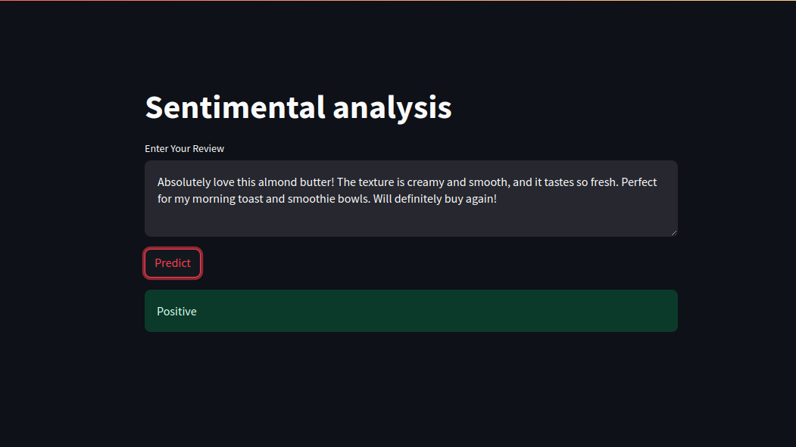
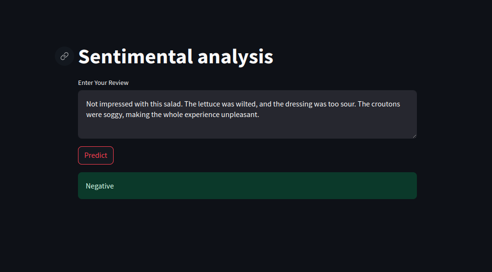
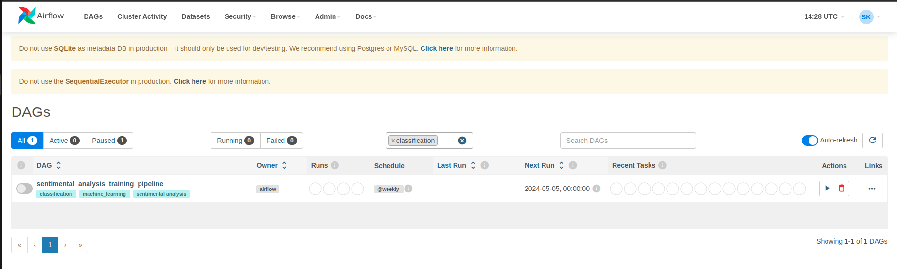

## Project Overview


The aim of this project is to develop an end-to-end machine learning pipeline for sentiment analysis of Amazon fine food reviews. The dataset contains reviews spanning over 10 years, with approximately 500,000 reviews up to October 2012. Each review includes product and user information, ratings, and a plaintext review. 

Using this data, we will build a classifier to determine whether a given review is positive or negative. The sentiment label will be derived from the review scores: reviews with scores of 1 or 2 will be labeled as negative, and those with scores of 4 or 5 will be labeled as positive. Reviews with a score of 3, which are considered neutral, will be excluded from the analysis.

### Scope

This Proof of Concept (PoC) will cover the following components:

1. **Data Ingestion**: Extracting data from a SQLite database and storing it in CSV format.
2. **Data Preprocessing**: Cleaning and preparing the text data for modeling.
3. **Data Transformation**: Applying feature extraction techniques to convert text data into numerical representations.
4. **Modeling**: Training and evaluating multiple machine learning models to classify the sentiment of the reviews.
5. **Model Tracking and Versioning**: Using DVC and MLflow to track data versions, model versions, and experiment metrics.
6. **Deployment**: Setting up the model for serving and providing an API for real-time sentiment analysis.
7. **Monitoring and Maintenance**: Implementing strategies for monitoring model performance and retraining as needed.

### Objective

The main objective is to demonstrate the feasibility and effectiveness of an automated pipeline that can handle large-scale text data, process it efficiently, and deliver accurate sentiment predictions. This will be achieved by:

- Extracting and preparing the data
- Engineering features suitable for machine learning
- Training, tuning, and evaluating various models
- Deploying the best-performing model
- Ensuring the pipeline is reproducible and maintainable

## Model Development

All the code used for model development stage is found in following directory
```src/components```

### Data Ingestion

The data ingestion process begins by extracting data from a SQLite database containing Amazon fine food reviews. The DataIngestion class is responsible for this task. It reads the reviews, filters out neutral ratings (score of 3), and converts the remaining scores into binary labels (positive or negative). The data is then cleaned by removing duplicates and ensuring the consistency of the 'Helpfulness' scores. After preprocessing, a balanced subset of 15,000 samples (7,500 positive and 7,500 negative) is created. Finally, the data is split into training and testing sets and saved as CSV files, ready for further processing.


### Data Preprocessing

The data preprocessing stage is crucial for preparing the text data for modeling. The `DataCleaner` class handles this process, ensuring that the textual data is clean and ready for analysis. The class utilizes various functions to clean and standardize the text. In this stage, the text data is systematically cleaned and prepared, ensuring that the downstream machine learning models can be trained on high-quality, standardized input. This process involves removing noise, handling contractions, and ensuring uniform text formatting, which are essential steps for effective text-based sentiment analysis.

**Text Cleaning Process:**
- **Decontraction**: Expands common contractions (e.g., "can't" to "cannot").
- **Removal of URLs and HTML Tags**: Uses regular expressions and BeautifulSoup to remove URLs and HTML tags from the text.
- **Special Character Removal**: Eliminates non-alphabetic characters and digits.
- **Lowercasing**: Converts all characters to lowercase to maintain uniformity.

The cleaned text is then saved into processed CSV files for both training and testing datasets.


### Data Transformation

The data transformation stage is a critical step for converting raw textual data into numerical features suitable for machine learning models. The `DataTransformation` class manages this process using a combination of feature extraction and encoding techniques. During this stage, the text data is transformed into numerical features that can be used for machine learning. This includes utilizing sentence transformer embeddings to capture the semantic meaning of the text. The processed features are then saved for both training and testing datasets, ensuring that the data is ready for model training and evaluation.


**Transformation Process:**

- **SentenceTransformer Embeddings**: The `TFIDF_BERT_transformer` class combines SentenceTransformer embeddings to convert text into meaningful numerical vectors. It uses the `SentenceTransformer` model to generate sentence embeddings.
- **Column Extraction**: The `ColumnExtractor` class is used to extract specific columns from the DataFrame.
- **Data Conversion**: The `Converter` class reshapes the DataFrame into a suitable format for further processing.

The transformation pipeline processes the cleaned text data, transforming it into feature arrays, which are then saved for both training and testing datasets.

### Model Training

The model training stage involves training multiple machine learning models with different hyperparameters, evaluating their performance, and selecting the best model. The `ModelTrainer` class manages this process, ensuring that the models are trained, evaluated, and tracked effectively. During this stage, various models are trained and evaluated to determine the best-performing model for sentiment analysis. The Logistic Regression model with the specified parameters achieved the highest metrics and is registered as the best model.

**Training Process:**

- **Hyperparameter Tuning**: Utilizes `GridSearchCV` to perform hyperparameter tuning for each model, optimizing parameters such as `C` and `solver` for Logistic Regression, `var_smoothing` for Naive Bayes, and `C`, `kernel`, and `gamma` for SVM.
- **Model Evaluation**: Evaluates model performance using metrics such as accuracy, precision, recall, and F1 score.
- **Model Tracking**: Logs metrics and parameters using MLflow for experiment tracking and model versioning.
- **Model Registration**: Registers the best-performing model to the MLflow model registry and transitions it to the "Production" stage.

The trained model, along with its parameters and performance metrics, is saved and tracked, ensuring reproducibility and easy deployment.


**Best Model Parameters and Metrics:**

- **Model**: Logistic Regression
- **Parameters**:
  - `C`: 0.1
  - `solver`: liblinear
- **Metrics**:
  - **Accuracy**: 0.9370
  - **Precision**: 0.9349
  - **Recall**: 0.9370
  - **F1 Score**: 0.9353

## Data Verisoing and 

### DVC Integration for Data Versioning

Data Version Control (DVC) is integrated into the pipeline to track different versions of the data throughout the stages, ensuring reproducibility and traceability. The `dvc.yaml` configuration file outlines the stages of the pipeline, detailing the commands, dependencies, outputs, and parameters for each stage. By integrating DVC into the pipeline, we can ensure that every step of the data processing and model training process is tracked, versioned, and reproducible, enhancing the reliability and maintainability of our machine learning workflow.

**Pipeline Stages:**

1. **Data Ingestion**: Extracts data from the SQLite database, processes it, and splits it into training and testing sets.
2. **Data Preprocessing**: Cleans the text data and saves the processed datasets.
3. **Data Transformation**: Transforms the text data into numerical features using TF-IDF and BERT embeddings.
4. **Model Training**: Trains various models with hyperparameter tuning, logs metrics, and registers the best model.


**Explanation of Stages in dvc yaml config:**

1. **Data Ingestion**:
   - **Command**: Runs the data ingestion script.
   - **Dependencies**: Includes the ingestion script and the SQLite database.
   - **Outputs**: Produces raw, train, and test CSV files.

2. **Data Preprocessing**:
   - **Command**: Runs the data preprocessing script.
   - **Dependencies**: Includes the preprocessing script, helper functions, and the ingested data.
   - **Outputs**: Produces processed train and test CSV files.

3. **Data Transformation**:
   - **Command**: Runs the data transformation script.
   - **Dependencies**: Includes the transformation script, helper functions, and the processed data.
   - **Outputs**: Produces the transformer object, transformed train, and test numpy arrays.

4. **Model Training**:
   - **Command**: Runs the model training script.
   - **Dependencies**: Includes the model training script, utility functions, configuration constants, and the transformed data.
   - **Outputs**: Produces the trained model pickle file.
   - **Metrics**: Logs performance metrics in `metrics.json`.
   - **Parameters**: Includes hyperparameters specified in `params.yaml`.


### Commands to Run the DVC Pipeline:

1. **Initialize DVC** (if not already done):
   ```bash
   dvc init
   ```

2. **Add Data and Outputs to DVC**:
   ```bash
   dvc add artifacts/database.sqlite
   ```

3. **Run DVC Pipeline**:
   ```bash
   dvc repro
   ```

4. **Push Data to Remote Storage** (if using remote storage):
   ```bash
   dvc remote add -d myremote s3://mybucket/path
   dvc push
   ```
### Model Tracking and Versioning with MLflow

Model tracking and versioning are essential for managing the lifecycle of machine learning models. Using MLflow, the `ModelTrainer` class handles the entire process of training, evaluating, tracking, and versioning models, ensuring that each experiment is logged, the best model is identified, and models are registered for deployment.

**Tracking and Versioning Process:**

- **Experiment Tracking**: MLflow is used to track experiments, logging parameters, metrics, and artifacts.
- **Model Evaluation**: Models are evaluated using metrics such as accuracy, precision, recall, and F1 score.
- **Model Registration**: The best-performing model is registered in the MLflow model registry and transitioned to the "Production" stage.

The trained model, along with its parameters and performance metrics, is logged and versioned, ensuring reproducibility and ease of deployment.

By integrating MLflow for model tracking and versioning, we can systematically manage the lifecycle of our machine learning models, ensuring that each experiment is logged, the best model is identified, and the models are easily accessible for deployment and monitoring.


### Deployment of Inference Pipeline

Deploying the inference pipeline involves setting up an environment where the trained model can be used to make predictions on new data. This includes loading the model, preprocessing the input data, and serving the predictions through an API. The deployment will be handled using Streamlit, and Docker will be used to containerize the application for easy deployment.

**Components of the Inference Pipeline:**

1. **Prediction Pipeline Class**:
   - **Initialization**: Loads the preprocessor and the best model.
   - **Fetch Best Model**: Retrieves the best model based on a specified metric from MLflow.
   - **Prediction**: Preprocesses the input features and generates predictions using the loaded model.

2. **Streamlit App**:
   - **User Interface**: Provides a text area for users to input reviews and a button to trigger predictions.
   - **Prediction Handling**: Uses the prediction pipeline to generate and display the sentiment prediction.

3. **Dockerfile**:
   - **Environment Setup**: Specifies the environment, installs dependencies, and sets up the application to run on Streamlit.

### Steps for Deployment:

1. **Prepare the Environment**:
   - Ensure that all necessary files (`app.py`, `inference_pipeline.py`, `requirements.txt`, `Dockerfile.flask`) are in the appropriate directories.

2. **Build Docker Image**:
   ```bash
   docker build -t sentiment-analysis-app -f Dockerfile.flask .
   ```

3. **Run Docker Container**:
   ```bash
   docker run -p 5000:5000 sentiment-analysis-app
   ```

4. **Access the Application**:
   - Open a web browser and navigate to `http://localhost:5000` to access the sentiment analysis application.

By following these steps, we we deploy an inference pipeline that loads the best model, preprocesses input data, and provides sentiment analysis predictions through a user-friendly web interface. The use of Docker ensures that the application is portable and can be easily deployed across different environments.

**Demo of model Serving**

Positive prediction:



Positive prediction:




### Model Retraining 

Retraining a machine learning model is essential to ensure it remains accurate and effective as new data becomes available. This process can be automated using Apache Airflow, which orchestrates the steps required to ingest, preprocess, transform, and train the model. The provided code sets up an Airflow DAG for retraining the sentiment analysis model on a weekly schedule. Docker is used to containerize the Airflow environment, ensuring consistency and portability.

**Components of the Retraining Pipeline:**

1. **Airflow DAG**:
   - **Tasks**: Defines tasks for data ingestion, preprocessing, transformation, and model training.
   - **Schedule**: Configured to run weekly.
   - **Error Handling**: Each task includes error handling to log and raise exceptions if failures occur.

2. **Dockerfile for Airflow**:
   - **Environment Setup**: Specifies the Python environment, installs dependencies, and sets up Airflow.
   - **Data Retrieval**: Downloads the SQLite database containing the data.

### Steps for Deployment:

1. **Prepare the Environment**:
   - Ensure that all necessary files (`airflow.dag`, `docker.airflow`, `requirements.txt`, etc.) are in the appropriate directories.

2. **Build Docker Image**:
   ```bash
   docker build -t airflow-sentiment-analysis -f docker.airflow .
   ```

3. **Run Docker Container**:
   ```bash
   docker run -p 8080:8080 airflow-sentiment-analysis
   ```

4. **Access Airflow**:
   - Open a web browser and navigate to `http://localhost:8080` to access the Airflow web interface.

5. **Trigger the DAG**:
   - In the Airflow web interface, trigger the `sentimental_analysis_training_pipeline` DAG to start the retraining process.

### Demo of AirFlow training pipeline


### Benefits of Using Airflow for Retraining:

- **Automation**: Schedules and automates the retraining process, ensuring that the model is always up-to-date with the latest data.
- **Orchestration**: Manages dependencies between tasks, ensuring that each step of the pipeline is executed in the correct order.
- **Monitoring**: Provides a user-friendly interface to monitor the progress and status of each task in the pipeline.
- **Scalability**: Can handle complex workflows and scale as needed to accommodate larger datasets and more computationally intensive tasks.

By integrating Airflow for retraining the model, we can ensure that the sentiment analysis model remains accurate and effective, adapting to new data and improving over time. The use of Docker ensures that the environment is consistent and can be easily deployed across different systems.


### Docker Compose and CI/CD for Deployment

To streamline the deployment of the sentiment analysis application, Docker Compose and GitHub Actions are utilized. Docker Compose orchestrates the deployment of multiple services (Airflow and Streamlit app) in a single, cohesive environment. GitHub Actions automate the build and deployment process, ensuring that the latest changes are continuously integrated and deployed.

**Components of the Deployment Setup:**

1. **Docker Compose**:
   - **Services**: Defines and orchestrates multiple services including Airflow for retraining and Streamlit for inference.
   - **Networking**: Manages the networking between the services, exposing necessary ports.

2. **CI/CD Pipeline with GitHub Actions**:
   - **Build and Push**: Automates the build and push of Docker images to Docker Hub.
   - **Continuous Integration**: Ensures that any changes pushed to the main branch are automatically built and deployed.

-- Docker Compose Configuration in `docker-compose.yml`

**Explanation:**
- **Airflow Service**: Builds and runs the Airflow service for orchestrating the retraining pipeline, exposing port 8080.
- **Streamlit App Service**: Builds and runs the Streamlit app service for serving the sentiment analysis predictions, exposing port 5000.

- CI/CD Pipeline with GitHub Actions defined in (`.github/workflows/docker-publish.yml`)

**Explanation:**
- **Checkout Repository**: Checks out the repository to access the source code.
- **Set up Docker Buildx**: Sets up Docker Buildx, a tool for building multi-platform Docker images.
- **Log in to Docker Hub**: Logs into Docker Hub using stored credentials.
- **Build and Push Airflow Image**: Builds and pushes the Docker image for the Airflow service.
- **Build and Push Streamlit App Image**: Builds and pushes the Docker image for the Streamlit app service.


### Steps for Deployment:

1. **Run Docker Compose**:
   ```bash
   docker-compose up
   ```

2. **Set Up GitHub Actions**:
   - verify `.github/workflows/docker-publish.yml` file defining the CI/CD pipeline.
   - Ensure that Docker Hub credentials are stored as secrets in the GitHub repository.

3. **Push Changes to GitHub**:
   - Push the changes to the main branch of the repository.
   - The GitHub Actions workflow will automatically build and push the Docker images.

By leveraging Docker Compose for service orchestration and GitHub Actions for CI/CD, we can efficiently manage and deploy our sentiment analysis application. This setup ensures that our application is always up-to-date with the latest changes, running in a consistent environment, and easily scalable.


### Conclusion

This PoC aims to showcase a comprehensive and robust approach to sentiment analysis using machine learning. By following best practices in data handling, model training, and deployment, the project demonstrates the potential for applying such techniques to real-world applications, ultimately enhancing decision-making processes based on customer feedback.


